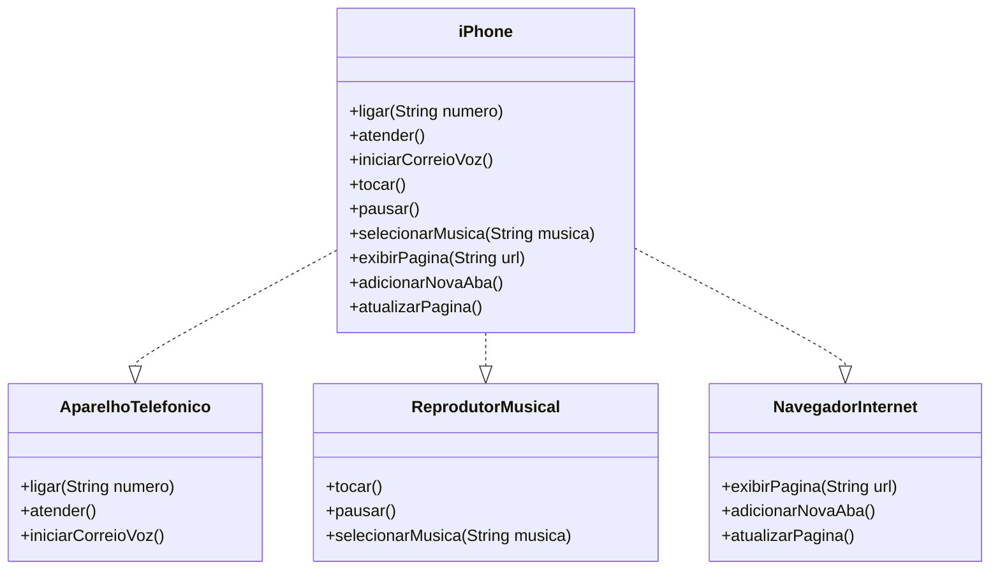

# Diagrama UML do IPhone 2007





## Implementações das Classes e Interfaces em Java

### Funcionalidades:

```java
package funcionalidades;

public interface AparelhoTelefonico {
	void ligar(String numero);
    void atender();
    void iniciarCorreioVoz();
}


public interface NavegadorInternet {
	void exibirPagina(String url);
    void adicionarNovaAba();
    void atualizarPagina();
}


public interface ReprodutorMusical {
	void tocar();
    void pausar();
    void selecionarMusica(String musica);
}

```

### Implementação na Classe IPhone:


```java

public class IPhone implements AparelhoTelefonico, ReprodutorMusical, NavegadorInternet {
	@Override
    public void ligar(String numero) {
        System.out.println("Ligando para " + numero + ".");
    }

    @Override
    public void atender() {
        System.out.println("Atendendo chamada.");
    }

    @Override
    public void iniciarCorreioVoz() {
        System.out.println("Iniciando correio de voz.");
    }

    @Override
    public void tocar() {
        System.out.println("Reproduzindo música.");
    }

    @Override
    public void pausar() {
        System.out.println("Música pausada.");
    }

    @Override
    public void selecionarMusica(String musica) {
        System.out.println("Selecionando a música: " + musica);
    }

    @Override
    public void exibirPagina(String url) {
        System.out.println("Abrindo página: " + url);
    }

    @Override
    public void adicionarNovaAba() {
        System.out.println("Nova aba adicionada.");
    }

    @Override
    public void atualizarPagina() {
        System.out.println("Atualizando página.");
    }
}


```